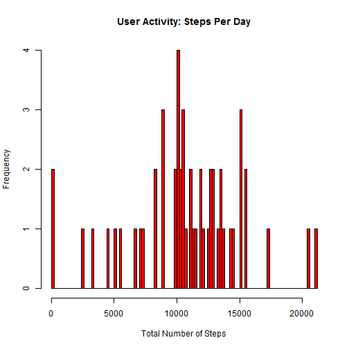
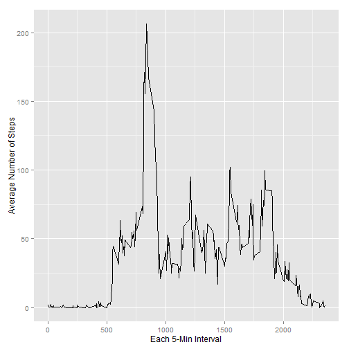
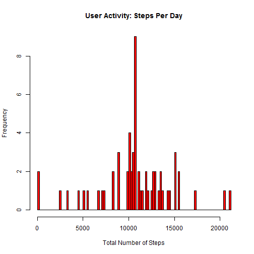
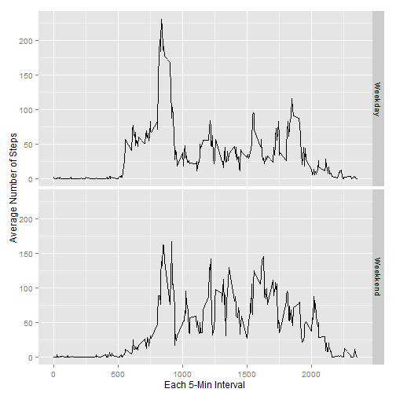

# Coursera Data Specialization - Reproducible Research: Peer Assessment 1

## Set up the environment

This code ckunk stores the current directory into a variable and then sets the
working directory to the cloned repository on local hard drive


```r
  setwd(workingDir)
  library(data.table)
  library(ggplot2)
```


## Unzipping and loading data into a CSV file
This code chunk unzips the activity.zip file and reads the content of activity.csv into a dataframe myCSV


```r
    unzip(zipfile = "activity.zip")
    myCSV = read.csv("activity.csv")
    summary(myCSV)
```

```
##      steps                date          interval     
##  Min.   :  0.00   2012-10-01:  288   Min.   :   0.0  
##  1st Qu.:  0.00   2012-10-02:  288   1st Qu.: 588.8  
##  Median :  0.00   2012-10-03:  288   Median :1177.5  
##  Mean   : 37.38   2012-10-04:  288   Mean   :1177.5  
##  3rd Qu.: 12.00   2012-10-05:  288   3rd Qu.:1766.2  
##  Max.   :806.00   2012-10-06:  288   Max.   :2355.0  
##  NA's   :2304     (Other)   :15840
```


## Finding the mean & median of activity data
This code chunk draws a histogram of the raw data and computes the mean and median of steps taken by date. NA values are ignored


```r
    sum1 = with(myCSV, aggregate(steps, by = list(date), sum))
    names(sum1) = c("date", "total_steps")
    head(sum1)
```

```
##         date total_steps
## 1 2012-10-01          NA
## 2 2012-10-02         126
## 3 2012-10-03       11352
## 4 2012-10-04       12116
## 5 2012-10-05       13294
## 6 2012-10-06       15420
```

```r
    hist(x = sum1$total_steps, 
         breaks = 100, 
         col = "red", 
         xlab = "Total Number of Steps",
         main = "User Activity: Steps Per Day")
```

 

```r
    myMean = mean(sum1$total_steps, na.rm = TRUE)
    print(myMean)
```

```
## [1] 10766.19
```

```r
    myMedian = median(sum1$total_steps, na.rm = TRUE)
    print(myMedian)
```

```
## [1] 10765
```
  
## Finding the time-interval with maximum number of average steps
This code chunk aggregates the activity data by time-intervals, draws a histogram and then locates he interval with highest level of activity (i.e maximum steps)


```r
    sum2 = with(myCSV, aggregate(steps, by = list(interval), mean, na.rm = TRUE))
    names(sum2) = c("interval", "average_steps")
    myPlot = ggplot(data=sum2, aes(x=interval, y=average_steps)) + 
                    geom_line() +
                    xlab("Each 5-Min Interval") + 
                    ylab("Average Number of Steps")
    print(myPlot)
```

 

```r
    maxSteps = sum2[which.max(sum2$average_steps),]
    print(maxSteps$interval)
```

```
## [1] 835
```

## Report on missing data
This code reports on the number of rows with missing data, i.e. FALSE

```r
     summary(is.na(myCSV$steps))
```

```
##    Mode   FALSE    TRUE    NA's 
## logical   15264    2304       0
```

## Impute median (by time-interval) for rows with missing observation
This code replaces all NA readings by the median of activity by time-interval and stores the simulated results into a dataframe: sum3

```r
    myCSV1 = merge(x = myCSV, y = sum2, by = "interval", all.x = T)
    myCSV1$steps_imputed = ifelse(is.na(myCSV1$steps), myCSV1$average_steps, myCSV1$steps)
    sum3 = with(myCSV1, aggregate(steps_imputed, by = list(date), sum))
    names(sum3) = c("date", "total_steps")
    head(sum3)
```

```
##         date total_steps
## 1 2012-10-01    10766.19
## 2 2012-10-02      126.00
## 3 2012-10-03    11352.00
## 4 2012-10-04    12116.00
## 5 2012-10-05    13294.00
## 6 2012-10-06    15420.00
```

## Finding the mean & median of activity data, AFTER imputing meadians to missing values
This code draws a histogram based on the simulated dataset above, and computes the mean and teh median

```r
    hist(x = sum3$total_steps, 
             breaks = 100, 
             col = "red", 
             xlab = "Total Number of Steps",
             main = "User Activity: Steps Per Day")
```

 

```r
    myMean = mean(sum3$total_steps, na.rm = TRUE)
    print(myMean)
```

```
## [1] 10766.19
```

```r
    myMedian = median(sum3$total_steps, na.rm = TRUE)
    print(myMedian)
```

```
## [1] 10766.19
```


## Study activity levels by Weekday VS. Weekend
This code collapses the dates into Weekday vs Weekend, and then computes the averages by time-interval. It then plots the activities into a panel separately showing the Weekday and Weekend averages

```r
    myCSV1$dow = weekdays(as.Date(myCSV1$date))
    myCSV1$dow_label = ifelse(myCSV1$dow %in% c("Saturday","Sunday"), "Weekkend", "Weekday")
    sum4 = aggregate(steps_imputed ~ interval + dow_label, data = myCSV1, mean)
    head(sum4)
```

```
##   interval dow_label steps_imputed
## 1        0   Weekday    2.25115304
## 2        5   Weekday    0.44528302
## 3       10   Weekday    0.17316562
## 4       15   Weekday    0.19790356
## 5       20   Weekday    0.09895178
## 6       25   Weekday    1.59035639
```

```r
    myPlot = ggplot(data = sum4, 
                    aes(x = interval, y = steps_imputed)) + 
                    geom_line() +
                    facet_grid(dow_label ~ .) + 
                    xlab("Each 5-Min Interval") + 
                    ylab("Average Number of Steps")
    print(myPlot)
```

 

## Revert back to starting directory
This code resets to starting directory

```r
    setwd(currentDir)
```
